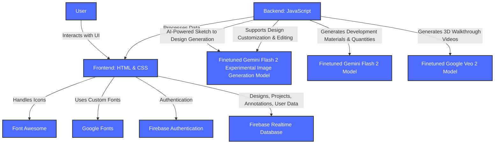

# **PropSketch.ai**

**Transform Your Sketches into Real Property Designs**

**PropSketch.ai** helps architects, interior designers, and property developers **turn rough property sketches into beautiful, realistic property designs** with AI-powered technology. From **sketch-to-design rendering and 3D walkthroughs** to **material lists and cloud storage**, every tool is built to simplify property visualization. Whether you're planning interiors or full developments, PropSketch.ai is your intelligent design partner from concept to showcase.

## 🚀 **Demo**

[Live Demo >](https://propsketch-ai.web.app/)

> **Note:** Sensitive credentials and API keys have been omitted from the codebase.

---

## 🎯 **Inspiration**

Property design is a complex process — starting with ideas on paper and ending with fully realized structures. But bringing those ideas to life takes time, tools, and often expensive software.

**What if AI could transform a sketch into a full digital design — complete with materials, walkthrough videos, and shareable outputs — in seconds?** What if design became more intuitive and faster?

**PropSketch.ai** was created to empower architects, designers, and developers to focus on creativity, not complexity. By combining **cutting-edge AI tools** with a streamlined interface, PropSketch.ai helps you **visualize, refine, and present your designs effortlessly** — from napkin sketch to polished proposal.

This is property design reimagined — faster, smarter, and neater.

---

## ✨ **Key Features**  

### **Sketch to Design**  

> **Upload your hand-drawn sketches and transform them into realistic interior or exterior colored designs with AI.**

### **3D Walkthrough**  

> **Generate stunning 3D video walkthroughs of your design to visualize the final outcome.**

### **Material Lists**  

> **Get comprehensive lists of materials needed for your design, complete with estimated quantities.**

### **Customization**  

> **Edit and customize your design with text prompts, annotations, labeling, and direct modifications.**

### **Cloud Storage**  

> **Save and access your property designs easily from anywhere with secure, encrypted cloud storage.**

### **Easy Sharing**  

> **Share your designs with clients and colleagues with simple cloud links and export options.**

---

## 🛠️ **Technology Stack**

- **Frontend:** HTML + CSS  

- **Backend:** JavaScript  

- **Image AI Model:** Finetuned Gemini Flash 2 Experimental Image Generation Model (for Sketch to Design Generation, Supports Design Customization & Editing, etc.)

- **Video AI Model:** Finetuned Google Veo 2 Model (Generates 3D Walkthrough Videos)

- **Text AI Model:** Finetuned Gemini Flash 2 Model (Generates Development Materials & Quantities)

- **Icons:** Font Awesome  

- **Fonts:** Google Fonts  

- **Authentication:** Firebase Authentication 
 
- **Database:** Firebase Realtime Database  

---

## 📋 **Impact & Benefits**

- **Design Faster & Smarter:** With AI-powered sketch to design conversion and 3D walkthrough videos, you can turn ideas into presentations in seconds.

- **Eliminate Guesswork:** Material lists and visual outputs help you estimate requirements accurately and make informed decisions before development.

- **Collaborate Effortlessly:** Share designs directly with teams or clients using simple cloud links and export tools.

- **Precision & Flexibility:** Whether you’re refining interiors or planning an entire layout, PropSketch.ai gives you full control to modify and improve designs on the go.

- **Secure & Accessible:** With cloud storage, your work is always safe and available wherever you need it.

- **Polished Presentations:** 3D walkthroughs and high-quality outputs help you present designs in an impressive, professional format.

---

## 🔮 **What’s Next for PropSketch.ai**

PropSketch.ai is evolving rapidly. Future updates will continue enhancing speed, output quality, and customization options — making it the ultimate design assistant for professionals.

- **AR/VR Integration:**  
  Support for immersive property walkthroughs using AR/VR for client presentations or on-site previews.

- **Import CAD & BIM Formats:**  
  Upcoming support for standard architectural file types and 3D Models to better integrate into your workflow.

Each improvement is aimed at delivering a **faster, smarter, and more flexible property design workflow**.

---

## 🚀 Getting Started

### Requirements:
- A modern web browser with JavaScript enabled.
- Stable internet connection for loading media and syncing data.

### Steps:
1. Open PropSketch.ai in your browser.  
2. Upload your sketch to begin.  
3. Let the AI render your property design.  
4. Explore 3D walkthroughs, download material lists, and share your project.

---

## 🤝 **Contributing**  

Contributions are always welcome! Please follow these steps:

1. Fork the repository.  
2. Create a new branch (`git checkout -b feature/your-feature`).  
3. Commit your changes (`git commit -m 'Add your message'`).  
4. Push to the branch (`git push origin feature/your-feature`).  

---

Built with ❤️ to make property design faster, smarter, and neater using AI.
